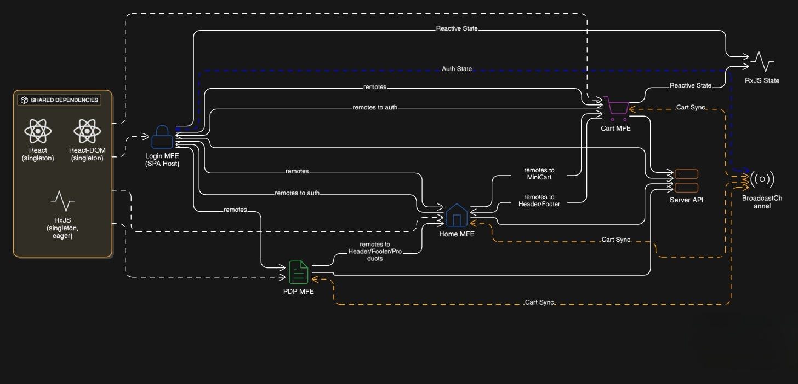
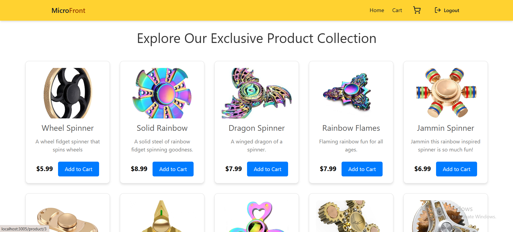
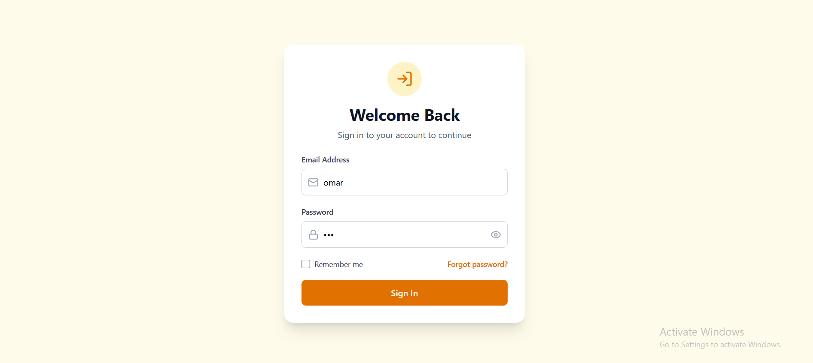
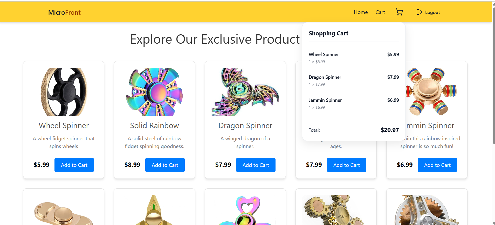
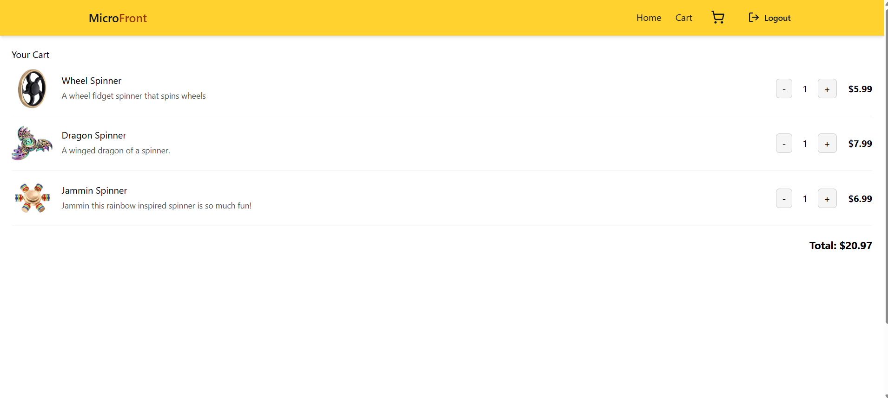

# Micro Frontend E-Commerce Application

A modular e-commerce application built using **Micro Frontend Architecture** with **Module Federation**, enabling independent development, deployment, and scaling of different application features.

## 🏗️ Architecture Overview

This project consists of **5 independent applications** communicating through Module Federation and BroadcastChannel APIs:

- **Server** (Port 8000) - Backend API
- **Home** (Port 3000) - Host application & product listing
- **PDP** (Port 3001) - Product Detail Page
- **Cart** (Port 3002) - Shopping cart functionality
- **Login** (Port 3005) - Authentication module



## Applications

### 1. Server (Port 8000)

Backend server handling API requests and authentication.

**TODO: Authentication Middleware**

- Create a NestJS middleware to check authentication cookies (i didn't implement it)
- Return authentication status (`{ isAuth: boolean }`)
- Protect routes based on authentication state

### 2. Home (Port 3000)

**Role**: Host Application & Product Catalog

**Module Federation Config:**

```javascript
{
  name: "home",
  filename: "remoteEntry.js",
  remotes: {
    cart: "cart@http://localhost:3002/remoteEntry.js",
    x: "login@http://localhost:3005/remoteEntry.js"
  },
  exposes: {
    "./Header": "./src/components/Header.tsx",
    "./Footer": "./src/components/Footer.tsx",
    "./Home": "./src/components/Layout.tsx",
    "./products": "./src/products.ts",
    "./styles": "./src/index.css"
  },
  shared: {
    react: { singleton: true },
    "react-dom": { singleton: true },
    rxjs: { singleton: true, eager: true }
  }
}
```

**Exposes:**

- Header component
- Footer component
- Home Layout component
- Product catalog data
- Global styles

### 3. PDP - Product Detail Page (Port 3001)

**Role**: Display detailed product information

**Module Federation Config:**

```javascript
{
  name: "pdp",
  filename: "remoteEntry.js",
  remotes: {
    home: "home@http://localhost:3000/remoteEntry.js"
  },
  exposes: {
    "./Product": "./src/components/ProductContent"
  },
  shared: {
    react: { singleton: true },
    "react-dom": { singleton: true },
    rxjs: { singleton: true, eager: true }
  }
}
```

**Exposes:**

- Product component (detailed product view)

**Consumes:**

- Home's product data
- Home's Header and Footer components

### 4. Cart (Port 3002)

**Role**: Shopping cart management

**Module Federation Config:**

```javascript
{
  name: "cart",
  filename: "remoteEntry.js",
  remotes: {
    home: "home@http://localhost:3000/remoteEntry.js",
    x: "login@http://localhost:3005/remoteEntry.js"
  },
  exposes: {
    "./MiniCart": "./src/components/MiniCart.tsx",
    "./styles": "./src/index.css",
    "./Cart": "./src/components/Layout.tsx",
    "./cart": "./src/hooks/cart.ts"
  },
  typescript: {
    type: "none"
  },
  shared: {
    react: { singleton: true, requiredVersion: undefined },
    "react-dom": { singleton: true, requiredVersion: undefined },
    rxjs: { singleton: true, eager: true }
  }
}
```

**Exposes:**

- MiniCart component (cart preview/icon)
- Cart Layout component (full cart page)
- Cart-specific styles
- Cart hooks for state management

### 5. Login (Port 3005)

**Role**: Authentication & User Session Management (SPA Host)

**Module Federation Config:**

```javascript
{
  name: "login",
  filename: "remoteEntry.js",
  remotes: {
    pdp: "pdp@http://localhost:3001/remoteEntry.js",
    home: "home@http://localhost:3000/remoteEntry.js",
    cart: "cart@http://localhost:3002/remoteEntry.js"
  },
  exposes: {
    "./auth": "./src/hooks/auth.ts"
  },
  shared: {
    react: { singleton: true },
    "react-dom": { singleton: true },
    rxjs: { singleton: true, eager: true }
  }
}
```

**Exposes:**

- Authentication hooks (RxJS-based)

**Special Role:**

- Acts as the **Single Page Application (SPA) host**
- Routes to all other micro frontends (Home, PDP, Cart)
- Maintains shared state across navigation
- Prevents state loss during routing between micro frontends

## State Management & Communication

### BroadcastChannel (Cross-Tab Synchronization)

Browser API for communication across multiple tabs/windows:

- Cart state synchronization across tabs
- Real-time updates when cart is modified in any tab
- Authentication state sync
- User session updates

```javascript
const channel = new BroadcastChannel("app_channel");

// Send message
channel.postMessage({ type: "CART_UPDATE", cart: cartData });

// Receive message
channel.onmessage = (event) => {
  if (event.data.type === "CART_UPDATE") {
    updateCartState(event.data.cart);
  }
};
```

### RxJS (Authentication & State Management)

Reactive state management for authentication and shared state:

- Observable-based auth state
- Cart state management
- Reactive form validation
- Side-effect handling

```javascript
// From login/auth
import { useAuth } from "login/auth";

const { isAuth, login, logout } = useAuth();
```

## Challenges & Solutions

During the development of this micro frontend architecture, I encountered several critical challenges. Here's how I solved them:

### Challenge 1: Remote Component Loading Failures

**Problem:**  
When a component from another micro frontend failed to load (due to network issues, build errors, or unavailable remote), the **entire application would crash**, leaving users with a blank screen and poor user experience.

**Solution: SafeComponent Pattern (Recommended)**  
Implement error boundaries around remote components to gracefully handle failures:

```javascript
import { ErrorBoundary } from "react-error-boundary";

function SafeComponent({ loader, fallback }) {
  return (
    <ErrorBoundary fallback={fallback || <div>Component unavailable</div>}>
      <React.Suspense fallback={<div>Loading...</div>}>
        {loader()}
      </React.Suspense>
    </ErrorBoundary>
  );
}

// Usage
<SafeComponent
  loader={() => import("cart/MiniCart")}
  fallback={<div>Cart temporarily unavailable</div>}
/>;
```

**Note:** For simplicity, SafeComponent is not implemented in this demo, but it's **highly recommended** for production applications.

---

### Challenge 2: State Loss During Navigation

**Problem:**  
Each micro frontend runs on its own port with **separate memory space**. When navigating between micro frontends (e.g., Home → PDP → Cart), the entire application state would **reset** because each navigation was essentially loading a new application. Additionally, **localStorage is not shareable between different ports**, making state persistence impossible across micro frontends.

**Impact:**

- Cart items would disappear when navigating to product details
- User authentication state would be lost
- No way to maintain application context

**Solution: Single Page Application (SPA) Host Pattern**  
I transformed the **Login micro frontend** into an SPA host that:

1. **Loads all other micro frontends as routes** within a single application
2. **Maintains a single memory space** for shared state
3. **Preserves state** during navigation between different micro frontends
4. **Shares localStorage** across all micro frontends (same origin)

**Implementation:**

```javascript
// In Login micro frontend (SPA Host)
import { BrowserRouter, Routes, Route } from "react-router-dom";
import Home from "home/Home";
import Product from "pdp/Product";
import Cart from "cart/Cart";
import Login from "./components/Login";
import RequireAuth from "./components/RequireAuth";

function App() {
  return (
    <BrowserRouter>
      <Routes>
        <Route index path="/login" element={<Login />} />
        <Route
          path="/"
          element={
            <RequireAuth>
              <Home />
            </RequireAuth>
          }
        />

        <Route
          path="/cart"
          element={
            <RequireAuth>
              <Cart />
            </RequireAuth>
          }
        />

        <Route
          path="/product/:id"
          element={
            <RequireAuth>
              <Product />
            </RequireAuth>
          }
        />
      </Routes>
    </BrowserRouter>
  );
}
```

**Benefits:**

- State persists across navigation
- Shared localStorage access
- Faster navigation (no full page reload)
- Better user experience

---

### Challenge 3: Cart State Inconsistency Across Tabs

**Problem:**  
When a user had the application open in **multiple browser tabs**:

1. User adds item to cart in **Tab 1**
2. User switches to **Tab 2** and clicks "Add to Cart"
3. **Tab 2's cart doesn't reflect changes from Tab 1**
4. Cart state becomes inconsistent across tabs
5. Users could lose items or see outdated cart data

**Why This Happened:**  
Even with the SPA pattern solving navigation issues, each browser tab maintains its **own JavaScript execution context and memory**. Changes in one tab's state don't automatically propagate to other tabs.

**Solution: BroadcastChannel API**  
I implemented the **BroadcastChannel API** to enable real-time synchronization across all browser tabs:

```typescript
// Initialize channel
export const cartChannel = new BroadcastChannel("cart-channel");

export const notifyCartChange = (message: any) => {
  cartChannel.postMessage(message);
};

export const listenCartChange = (
  callback: (message: { event: string; data: any }) => void
) => {
  cartChannel.onmessage = (e) => {
    callback(e.data);
  };
};
```

**How It Works:**

1. User adds item to cart in Tab 1
2. Tab 1 broadcasts update via BroadcastChannel
3. All other tabs receive the message instantly
4. Each tab updates its local cart state
5. All tabs now show consistent cart data

**Benefits:**

- Real-time synchronization across all tabs
- Consistent cart state everywhere
- Works with SPA pattern seamlessly
- Native browser API (no external dependencies)

---

## Application Showcase

### Home Page


_Main landing page with product catalog and navigation_

### Login Page


_Authentication interface for user login_

### Mini Cart Preview


_Quick cart preview accessible from any page_

### Shopping Cart


_Full cart view with item management and checkout_

## Module Federation Setup

### Shared Dependencies

All applications share React, React-DOM, and RxJS as singletons to ensure:

- Single instance across all micro frontends
- Consistent React context
- Reduced bundle size
- Shared state management capabilities

RxJS is loaded with `eager: true` to ensure it's available immediately for authentication and state management.

### Remote Loading

Each micro frontend dynamically loads remote modules at runtime:

1. SPA host (Login) loads `remoteEntry.js` from remote apps
2. Remote modules are fetched on-demand
3. Shared dependencies are reused when possible
4. Navigation between micros happens without page reload

## Installation & Setup

### Prerequisites

- Node.js (v21+)
- npm or yarn

### Install Dependencies

```bash
# Install for all applications
cd home && npm install
cd ../pdp && npm install
cd ../cart && npm install
cd ../login && npm install
cd ../server && npm install
```

### Start Development Servers

```bash
# Terminal 1 - Server
cd server && npm run dev

# Terminal 2 - Home
cd home && npm run dev

# Terminal 3 - PDP
cd pdp && npm run dev

# Terminal 4 - Cart
cd cart && npm run dev

# Terminal 5 - Login (SPA Host)
cd login && npm run dev
```

### Access Points

- **Main Application (SPA Host)**: http://localhost:3005
- Home (standalone): http://localhost:3000
- PDP (standalone): http://localhost:3001
- Cart (standalone): http://localhost:3002
- API Server: http://localhost:8000

**Note:** For the full experience with state persistence, use the main application at port 3005.

## TODO & Known Issues

### Authentication

- [ ] Implement NestJS authentication middleware
- [ ] Add cookie-based session validation
- [ ] Create auth status endpoint (`/api/auth`)
- [ ] Handle unauthorized access in frontend
- [ ] Add token refresh mechanism

### State Management

- [x] BroadcastChannel setup for cross-tab sync
- [x] RxJS for authentication and cart state
- [x] SPA pattern for state persistence
- [ ] Implement state versioning
- [ ] Add offline state caching

### Module Federation

- [x] Basic setup complete
- [x] SPA host pattern implemented
- [ ] Add error boundaries for remote loading failures (SafeComponent)
- [ ] Implement loading states for remote components
- [ ] Add fallback UI for offline remotes
- [ ] Performance optimization for remote loading

## Technology Stack

- **Frontend**: React, TypeScript
- **Backend**: NestJS (planned)
- **Module Federation**: Webpack 5 Module Federation
- **State Management**: RxJS, BroadcastChannel API
- **Routing**: React Router (in SPA host)
- **Build Tool**: Webpack 5

## Development Guidelines

### Adding New Micro Frontends

1. Create new app with Module Federation config
2. Choose unique port number
3. Define exposed modules in `exposes`
4. Import remote modules in `remotes`
5. Add route in Login (SPA host) application
6. Update this README with new service

### Communication Best Practices

- Use **BroadcastChannel** for cross-tab synchronization
- Use **RxJS** for complex async state management
- Leverage **SPA host pattern** for state persistence
- Avoid tight coupling between micro frontends
- Always handle remote loading errors gracefully

### Module Federation Tips

- Always use singleton for React/React-DOM/RxJS
- Expose only necessary components/utilities
- Version shared dependencies carefully
- Implement error boundaries for production (SafeComponent pattern)
- Test cross-tab synchronization thoroughly
- Use the SPA host for main user flows

## Architecture Decisions

### Why Login as SPA Host?

I chose the Login micro frontend as the SPA host because:

1. **Authentication First**: Users must authenticate before accessing most features
2. **Central Entry Point**: Natural starting point for the application
3. **Security**: Can enforce authentication checks before loading other micros
4. **State Management**: Ideal location for maintaining global application state

### Why BroadcastChannel over EventBus?

Initially, I used a custom EventBus for communication, but switched to BroadcastChannel because:

1. **Cross-Tab Support**: EventBus only works within a single tab
2. **Native API**: No custom implementation needed
3. **Reliability**: Browser-native implementation is more stable
4. **Real-Time Sync**: Instant propagation across all tabs
5. **Simplicity**: Cleaner API for our use case

## 👥 Contributors

Omar Mohamed

---

**Note**: This is an active development project demonstrating micro frontend architecture patterns. The solutions implemented here address real-world challenges in building distributed frontend applications.
